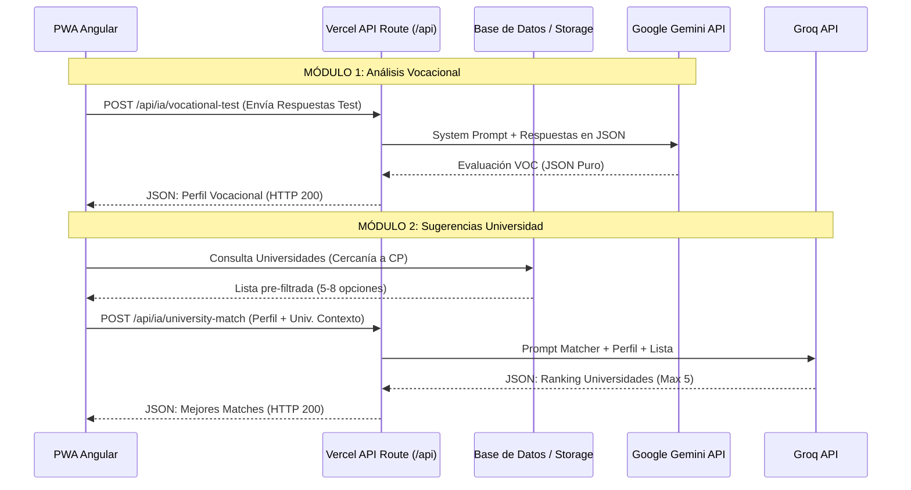

# SteamVocation - Especificación Técnica de IA y API

## 1. Resumen Ejecutivo
SteamVocation es una aplicación PWA (Progressive Web App) desplegada en Vercel. Su funcionalidad núcleo es realizar un análisis vocacional basado en el modelo STEAM (Ciencia, Tecnología, Ingeniería, Artes, Matemáticas) para recomendar carreras y universidades locales afines al perfil de cada usuario. 

La arquitectura omite un backend tradicional y un procesamiento monolítico en favor de **Serverless API Routes** (desplegadas en Vercel sobre Next.js/Node). Estas rutas actúan como middleware seguro para intercomunicar el frontend de la aplicación con modelos de inteligencia artificial externos (Google Gemini y Groq). Esto mantiene el Frontend seguro, sin estado y ágil.

## 2. Arquitectura General
El flujo lógico del sistema se divide en dos módulos secuenciales e interdependientes:



## 3. Especificación del Endpoint: Módulo 1 (Test Vocacional)

*   **Ruta Recomendada:** `POST /api/ia/vocational-test`
*   **Descripción:** Toma las respuestas dadas al test por el usuario, envía el conjunto al motor Gemini 2.0 Flash y devuelve un esquema STEAM consolidado.
*   **Cabeceras Requeridas:** `Content-Type: application/json`
*   **Posibles Errores:** `400 Bad Request` (payload vacío o con formato erróneo), `500 Internal Server Error` (Falla del servicio Gemini o error de mapeo JSON interno).
*   **Carga útil (Request Body - Frontend envía):**

```json
{
  "respuestas": [
    { "id": 1, "texto": "¿Qué prefieres?", "respuesta": "Arreglar electrodomésticos" },
    { "id": 2, "texto": "¿Qué revista leerías?", "respuesta": "Revista de divulgación científica" }
  ]
}
```

## 4. Especificación del Endpoint: Módulo 2 (Universidades Cercanas)

*   **Ruta Recomendada:** `POST /api/ia/university-match`
*   **Descripción:** Compara de manera analítica el recién generado "perfil STEAM" con una inyección contextual de **máximo 8** universidades (filtradas localmente o por base de datos usando el código postal).  Devuelve las mejores y argumenta la sugerencia.
*   **Carga útil (Request Body - Frontend envía):**

```json
{
  "perfil_steam": {
    "perfil_nombre": "Tecnología + Ciencia",
    "desglose_steam": { "ciencia": 100, "tecnologia": 0, "ingenieria": 0, "artes": 0, "matematicas": 0 }
  },
  "ubicacion": {
    "codigo_postal": "94500",
    "ciudad": "Córdoba"
  },
  "universidades_contexto": [
    {
      "id": "utcv_001",
      "nombre": "Universidad Tecnológica (UTCV)",
      "carreras": ["Ingeniería de Software", "TICs"],
      "distancia_km": 5,
      "sitio_web": "https://www.utcv.edu.mx"
    }
  ]
}
```

## 5. Estructura Exacta del JSON de Salida (Desde la API al Frontend)

Estas implementaciones deben ser aplicadas tanto en los *responseSchema* de las llamadas IA como en los Typings/Interfaces del lado Frontend de Angular.

### Salida Módulo 1 (Generada por Gemini)
```json
{
  "perfil_nombre": "Tecnología + Ciencia",
  "afinidad_global_steam": 33,
  "categoria_dominante": {
    "nombre": "Ciencia",
    "porcentaje": 100,
    "icono": "ciencia"
  },
  "categoria_secundaria": {
    "nombre": "Tecnología",
    "porcentaje": 0,
    "icono": "tecnologia"
  },
  "categoria_terciaria": {
    "nombre": "Ingeniería",
    "porcentaje": 0,
    "icono": "ingenieria"
  },
  "desglose_steam": {
    "ciencia": 100,
    "tecnologia": 0,
    "ingenieria": 0,
    "artes": 0,
    "matematicas": 0
  },
  "adn_steam": {
    "descripcion": "Eres una persona curiosa con gran afinidad por la tecnología y la innovación. Tienes perfil analítico, ideal para ingeniería o ciencias de la computación.",
    "etiquetas": ["Ciencia", "Tecnología", "Ingeniería"]
  },
  "carreras_recomendadas": [
    {
      "nombre": "Ingeniería de Software",
      "universidad_referencia": "Universidad Tecnológica (UTCV)",
      "icono": "software"
    },
    {
      "nombre": "Ing. Mecatrónica",
      "universidad_referencia": "Instituto Politécnico Nacional (IPN)",
      "icono": "mecatronica"
    }
  ]
}
```

### Salida Módulo 2 (Generada por Groq)
```json
{
  "total_resultados": 2,
  "zona_buscada": "Córdoba, Veracruz",
  "universidades": [
    {
      "id": "utcv_001",
      "nombre": "Universidad Tecnológica (UTCV)",
      "carrera": "Ingeniería de Software",
      "ubicacion": {
        "ciudad": "Veracruz",
        "distancia_km": 5,
        "modalidad": "Presencial"
      },
      "match_porcentaje": 95,
      "razon_match": "Combina perfectamente con tu perfil tecnológico y analítico.",
      "fechas_clave": [
        {
          "evento": "Examen de Admisión",
          "fecha": "Junio 2026"
        }
      ],
      "plan_estudios_sugerido": [
        "Programación Avanzada",
        "Redes",
        "Bases de Datos"
      ],
      "sitio_web": "https://www.utcv.edu.mx"
    }
  ]
}
```
*Nota: Si se solicitaron propiedades adicionales como sitio_web o modalilidad y la BD no lo tiene mapeado para alguna, se devolverán valores por default en `null` o una advertencia en UI, dependiendo de los requieremientos.*

## 6. Configuración Estricta de la IA (Para el desarrollador Backend)

Para cumplir la restricción máxima ("La IA debe responder ÚNICAMENTE con el JSON, sin texto explicativo", y de forma nativamente parceable):

**Módulo 1: Gemini (Recomendado `@google/genai` en JS/TS)**
*   **Modelo:** `gemini-2.0-flash`
*   **Parámetros:** `temperature: 0.2` (permite algo de creatividad a los párrafos de "ADN STEAM", pero lo suficiente analítico para los puntajes).
*   **Regla Obligatoria:** Debes configurar el atributo nativo de Gemini **`responseMimeType: 'application/json'`**. También debes usar `responseSchema` provisto del SDK nativo para obligar la forma del objeto y propiedades obligatorias.

**Módulo 2: Groq (Llama-3.3-70b-versatile)**
*   **Modelo:** `llama-3.3-70b-versatile`
*   **Parámetros:** `temperature: 0.1` (análisis técnico objetivo al buscar el match).
*   **Regla Obligatoria:** Habilitar **`response_format: {"type": "json_object"}`**. 
*   **System Prompt:** Agregar esta explícita instrucción como final del prompt de sistema: 
    *`"You are an API processing server. You MUST respond ONLY with a valid JSON object. Do not include markdown codeblocks (no ```json ... ``` tags). Do not add any conversational text. Return only the parsable raw JSON string."`*

## 7. Manejo de Errores y Edge Cases

1.  **Markdown Hallucinations (Alucinaciones de Formato):** A pesar de los controles `json_object`, algunos LLMs pueden regresar el objeto rodeado de tildes graves por accidente (ej/ ` ```json ... ``` `). 
    *   **Solución (Obligatoria Backend):** Siempre purgar la cadena antes de procesarla: `let cleanStr = response.choices[0].message.content.replace(/```json/gi, '').replace(/```/g, '').trim(); JSON.parse(cleanStr);`
2.  **Suma Incorrecta del Desglose STEAM:** A veces los LLMs sufren con sumas asimétricas. 
    *   **Solución:** Al recibir los 5 porcentajes STEAM en la ruta Vercel, programar una validación trivial que normalice al 100% sumando los pesos proporcionalmente si no cuadran explícitamente en el rango.
3.  **Falta de Bases de Datos (Universidades insuficientes)**: Si se inyecta sólo 1 universidad desde la base de datos de contexto al prompt.
    *   El prompt de Groq debe considerar expresamente este escenario ("Si solo recibes 1 universidad, analízala con respecto al perfil y ajusta el JSON dinámico").

## 8. Estimado de Costos, Tokens y Límites en Planes Gratis

| Aspecto | Módulo 1 (Gemini) | Módulo 2 (Groq) |
| :--- | :--- | :--- |
| **Tokens Entrada Estimados (Input)** | ~800 | ~1,200 |
| **Tokens Salida Estimados (Output)** | ~350 | ~450 |
| **Plan Gratis (Restricciones)** | 15 RPM / 1 Millón TPM | 30 RPM / 6,000 TPM |
| **Recomendación y Riesgos** | Es sumamente robusto para uso continuo. Sobrado para tráfico casual o PWA recién liberada. | **ALERTA**: Groq con LLaMA 70B tiene un TPM bajo en Tier gratuito (6k). Si mandas *muchas universidades_contexto* por petición superarás el límite rápido. **Mantén el prefiltro en máximo 5 a la vez.** |

## 9. Recomendaciones de Seguridad Arquitectónica

*   **API KEYS INVISIBLES (Obligatorio):** Evitar bajo cualquier circunstancia exponer `GEMINI_API_KEY` o `GROQ_API_KEY` en el bloque de variables `environment.prod.ts` para frontend en Angular. Las llaves deben colocarse en las **Variables de Entorno (Environment Variables) del dashboard de Vercel** para uso exclusivo del servidor (Vercel Node/Edge).
*   **Timeouts en la Vercel Hobby Tier:** El plan totalmente gratis en Vercel mata procesos backend a los `10 segundos` clavados. Si Groq o Gemini se atoran debido a la conexión o latencia, pueden disparar un Error Múltiple (`504 Gateway Timeout`). Es recomendable si persiste el problema configurar `export const runtime = 'edge';` en las Api Routes respectivas para agilizar y ampliar tolerancias, o actualizar el plan.
*   **Autorizaciones CORS:** Aplicar un *Middleware* o chequeo a la solicitud para que tus endpoints Vercel rechacen cualquier consulta API que NO proceda oficialmente de la URL/dominio de tu App desplegada.

## 10. Ejemplo de Llamada Componentada (Frontend a Vercel)

Una demostración teórica sencilla usando RxJS en el entorno de Angular (`OnboardingService`).

```typescript
import { Injectable } from '@angular/core';
import { HttpClient, HttpHeaders } from '@angular/common/http';
import { Observable, catchError, throwError } from 'rxjs';

@Injectable({
  providedIn: 'root'
})
export class VocationalApiService {
  // En producción tu url sería "/api/ia/vocational-test" relativo 
  // al propio dominio si la PWA y Vercel Routes se hostean juntos
  private readonly module1Url = '/api/ia/vocational-test';

  constructor(private http: HttpClient) {}

  public processTestScores(answers: UserAnswer[]): Observable<VocationalProfile> {
    const payload = { respuestas: answers };
    const headers = new HttpHeaders({ 'Content-Type': 'application/json' });

    return this.http.post<VocationalProfile>(this.module1Url, payload, { headers })
      .pipe(
        catchError(error => {
          console.error('[STEAM_API] Error interactuando con Module 1', error);
          return throwError(() => new Error('Error al procesar el perfil STEAM'));
        })
      );
  }
}
```
